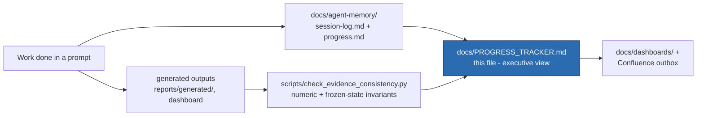

# VEGO-AI Progress Tracker

**Single-source, at-a-glance status.** For the full chronological log see `docs/agent-memory/progress.md`;
for the maintenance flow see §8. Auto regions are refreshed by `python scripts/build-progress-tracker.py`.

> **July 2026 redirect (added 2026-07-04):** per the 2026-07-01 supervisor meeting, the FRAMEWORK track is
> now the active priority - H-layer skills map and prompt requirements for the 2026-07-15 meeting (see
> `docs/research/extension-plan-2026-07-supervisor-redirect.md`). Phase F (expert labels) below remains the
> binding constraint of the PARKED evaluation track, not the current work item.

> **H-layer advancement checkpoint (2026-07-10):** Phase 0 truth/governance reconciliation is the current
> documentation gate. Phase 1 awaits recorded M-02..M-05 outcomes. Offline contract/harness hardening may
> proceed without protected runtime changes. Phase 4 live shadow-listener work is blocked by M-05 plus a
> separate exact-file implementation authorization. The worktree is dirty; historical merged/tagged states
> do not imply that the current workspace is clean or finalized.

<!-- AUTO:stamp:start -->
As of 2026-07-10 19:22 UTC · branch `main` · HEAD `c72b845` · evidence baseline commit `0976c05` · generated by `scripts/build-progress-tracker.py`
<!-- AUTO:stamp:end -->

---

## 1. Snapshot
> **Two tracks are active:** offline H-layer architecture/experiment advancement and the human-gated evaluation
> preparation. Nine H-layer iterations are accepted; iteration 008 established atomic reliability and iteration 009 repaired offline contracts/metrics without selecting defaults.
> Until at least 20 generalization-safe labels exist, accuracy improvement cannot be evaluated.

<!-- AUTO:phases:start -->
| Phase | Status | % |
| --- | --- | ---: |
| A. Artifact build (M1→M4B-1) | ✅ Complete, merged, tagged | 100% |
| B. Inspection (dashboard + visualizer) | ✅ Complete, merged | 100% |
| C. Evaluation tooling (EXP-001…005 + harness + guard) | ✅ Complete | 100% |
| D. Annotation package (bias/leakage-controlled) | ✅ Ready to send | 100% |
| E. Thesis write-up | 🟦 10 / 10 chapters drafted | ~100% |
| F. Empirical evidence (expert labels → results) | 🟥 Blocked on human labeling | 0% |
<!-- AUTO:phases:end -->

### Label collection (the binding constraint)
<!-- AUTO:labels:start -->
`safe labels filled: 0 / 24` — need **≥20** before any quantitative claim (pilot at 1–19; blocked at 0). reviewer-1 0, reviewer-2 0, adjudicated 0.
<!-- AUTO:labels:end -->

---

## 2. Milestones (artifact)
| Milestone | What it delivers | Status |
| --- | --- | --- |
| M1 Human Review Queue (+M1.2 signature) | detect where human judgment is needed | ✅ merged |
| M2 Human Feedback Manager | schema-validated structured feedback | ✅ merged |
| M3 Human Judgment Memory | reusable, provenance-tracked judgment + explainable retrieval | ✅ merged |
| M4A Memory Advisory Layer | advice only; `ai_classification_changed=0` | ✅ merged |
| M4B-1 Memory-Informed Comparison | deterministic, non-destructive parallel comparison | ✅ merged |
| M4B-2 LLM reclassification | — | ⛔ blocked (out of scope) |

Stable tags: `official-vego-ai-baseline` · `research-state-m4a-clean` · `research-state-results-dashboard` ·
`research-state-m4b1-deterministic-comparison` · `research-state-visualizer-ux-clean`.

## 3. Experiments
| Exp | Purpose | Status | Key result |
| --- | --- | --- | --- |
| EXP-001 | mechanism/readiness eval | ✅ done | 27 rows, 0 changes, **0 safe labels** |
| EXP-002 | expert-labeling package | ✅ done | 27 rows, 24 safe candidates |
| EXP-003 | accuracy-improvement tooling + bias/leakage-controlled annotation package | ✅ tooling done | gate: *cannot be evaluated yet* |
| EXP-004 | policy-sensitivity (synthetic) | ✅ done | screening only, not evidence |
| EXP-005 | real-label gate + adjudication + κ | ✅ tooling done | 0 valid labels → gate closed |
| EXP-006–008 | observation contracts, dosage, trigger replay | iteration-009 repairs accepted | 501 ObservationRecords; Pareto/workload evidence only, no default |
| EXP-009/010 | H-Verify/convergence synthetic prototypes | provisional runs; protocol unapproved | assumption-driven, not real-expert validation |
| EXP-011 | V0/V1 evaluation | parked | architecture + labels + supervisor go-ahead required |
| EXP-012 | validated baseline interface | repaired / cross-check PASS | safe N=0 → `NOT YET COMPUTABLE`; no evidence claim |
| EXP-013–018 | architecture-conformance series | offline fixture runs + validator pass | scoped mechanism/safety evidence; atomic iteration acceptance separate |

## 4. Thesis (`thesis/chapters/`)
| Drafted (10) | Remaining quantitative completion |
| --- | --- |
| 1 Intro · 2 Related Work (verified cites) · 3 Problem/RQ · 4 Baseline · 5 Artifact · 6 Methodology · 7 Experimental Results/current evidence · 8 Threats · 9 Discussion · 10 Conclusion | **Chapter 7 quantitative accuracy/reliability sections** — need EXP-005 expert labels |

## 5. Gates & invariants (must stay true)
<!-- AUTO:invariants:start -->
| Invariant | Value | Checked by |
| --- | --- | --- |
| Tests passing | **94 passed _(rerun with --run-tests to refresh)_** | `pytest VEGO-AI/tests` |
| `ai_classification_changed` | **0** | dashboard / guard |
| baseline `eval_output` modified | **false** | guard |
| memory-informed differs from original | **0 / 27** | guard |
| generalization-safe expert labels | **0** | guard |
| deterministic policy | **v1 (no M4B-1.1 in code)** | guard |
| evidence consistency | **18/18 present checks passed PASS** | `scripts/check_evidence_consistency.py` |

Scale figures: **179** models · **27** patterns · **11** review items · **3** reusable judgments · **8** advice items.
<!-- AUTO:invariants:end -->

## 6. Critical path (what actually unblocks the thesis)
1. ⛔ **Supervisor approves** `docs/research/supervisor-label-approval-pack.md`: annotation protocol + reviewer panel + ethics/consent + claim boundary. *(owner: supervisor)*
2. ⛔ **Two experts label** the 24 blind rows (`reports/generated/exp003/annotation_package/blind_sheet_reviewer{1,2}.csv`). *(owner: experts)*
3. ⛔ **κ + adjudication** → freeze `gold_labels.csv`. *(owner: human)*
4. ▶️ **Run evaluation** on real labels → update **Chapter 7 quantitative results**. *(owner: agent, on request)*
5. ▶️ Only if errors warrant: design **M4B-1.1** on the 16 dev rows, test once on the sealed 8 holdout. *(owner: agent, after approval)*

Everything before step 4 is **human-gated for the evaluation track**. Offline architecture contracts, harness reliability, and conformance experiments may proceed without changing baseline behavior or selecting unapproved defaults.

### H-layer architecture/flow gates

1. Finish Phase 0 cross-surface reconciliation and preserve the protected-path fingerprints.
2. Record M-02..M-05; blank or ambiguous outcomes remain deferred and cannot become defaults.
3. Preserve iteration-009 contract/metric semantics; keep iterations 010/011 blocked until their stated gates clear.
4. Keep Phase 4 blocked until M-05 plus the separate five-file authorization record are explicit.

## 7. Frozen / not allowed (until evidence + approval)
M4B-2 · Agent 4 changes · LLM/API calls · embeddings · policy v1.1 · baseline overwrite · any accuracy claim.

## 7b. Recent activity (latest session-log entries)
<!-- AUTO:activity:start -->
- 2026-06-29 12:27 +03:00 - Codex - Thesis Chapter 7 Progress
- 2026-06-29 15:09 +03:00 - Codex - Supervisor EXP-005 Approval Pack
- 2026-06-29 15:20 +03:00 - Codex - PhD Thesis Optimization And Claude Collaboration
- 2026-06-29 15:39 +03:00 - Codex - Doctoral Capability Alignment
- 2026-06-29 16:33 +03:00 - Codex - Architecture Health Verification
- 2026-06-29 16:35 +03:00 - Codex - E2E Dashboard Path Rendering Fix
<!-- AUTO:activity:end -->

---

## 8. Tracking architecture & maintenance plan

How progress is produced and kept current (this tracker is the executive view on top of the detailed logs):

**Update rules**
- **Source of truth for detail:** `docs/agent-memory/progress.md` (chronological) + `session-log.md`. This
  tracker summarizes them — update it when a phase/milestone/experiment/chapter status changes, not for every edit.
- **Before any status/claim update:** run `python scripts/check_evidence_consistency.py` (must be PASS) so the
  invariants in §5 are real; never edit §5 by hand to a value the guard contradicts.
- **Cadence:** refresh §1 phase board + §5 invariants whenever the evidence baseline commit changes or a gate
  flips (e.g. first real expert labels arrive → Phase F moves off 0%, EXP-005 gate text changes).
- **Do not duplicate:** the deep dashboards/visualizations remain in `docs/dashboards/` and
  `docs/operations/progress-update-architecture.md`; this file links to them rather than copying them.
- **Owner column discipline:** keep §6 honest about *who* unblocks each step (supervisor / experts / agent) so
  it is always clear that the remaining critical path is human-gated.
