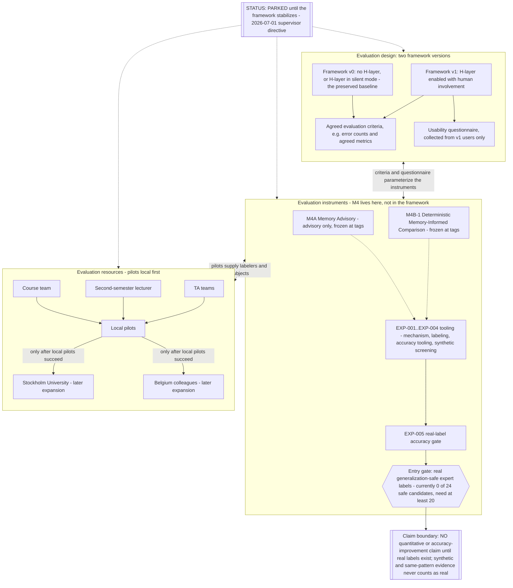

# VEGO-AI Evaluation Diagram - Parked Evaluation Track

Last updated: 2026-07-04 by Fable (Claude).

This is the EVALUATION view required by the 2026-07-01 supervisor meeting (notes:
`docs/research/meetings/2026-07-01-supervisor-meeting-iris.md`). Iris invoked the design-science
build-versus-evaluate distinction and directed that everything evaluation-related move OUT of the framework
diagram into this separate one, and that evaluation not proceed until the framework stabilizes. The
framework itself is in `docs/architecture/framework-diagram.md`; M4 components appear only here, never
wired into the framework diagram.

## Status: PARKED / FUTURE

No evaluation work proceeds until the framework stabilizes, and no quantitative claim is permitted until
real expert labels exist (EXP-005 gate, currently 0 generalization-safe labels).

## Reading The Track

- Version 0 vs. Version 1 is the core comparison Iris asked for: the same framework without and with human
  involvement, compared on agreed criteria (e.g., error counts), plus a usability questionnaire answered by
  Version 1 users only.
- M4A and M4B-1 are evaluation instruments here - repositioned out of the framework per the M3-vs-M4
  distinction: judgment memory belongs to the framework (H3), advisory/comparison belongs to evaluation.
- EXP-005 remains the current evidence gate: 0 of 24 generalization-safe candidate rows are labeled; at
  least 20 valid, generalization-safe expert labels are required before any quantitative reporting (1-19 is
  pilot-only). Labels must come from real experts - never invented, auto-filled, or synthetic.
- Resources per the meeting: local course team, the second-semester lecturer, and TA teams run pilots
  first; Stockholm University and Belgium colleagues (modeling courses with hundreds of students) are
  later-stage expansions only after local pilots succeed.
