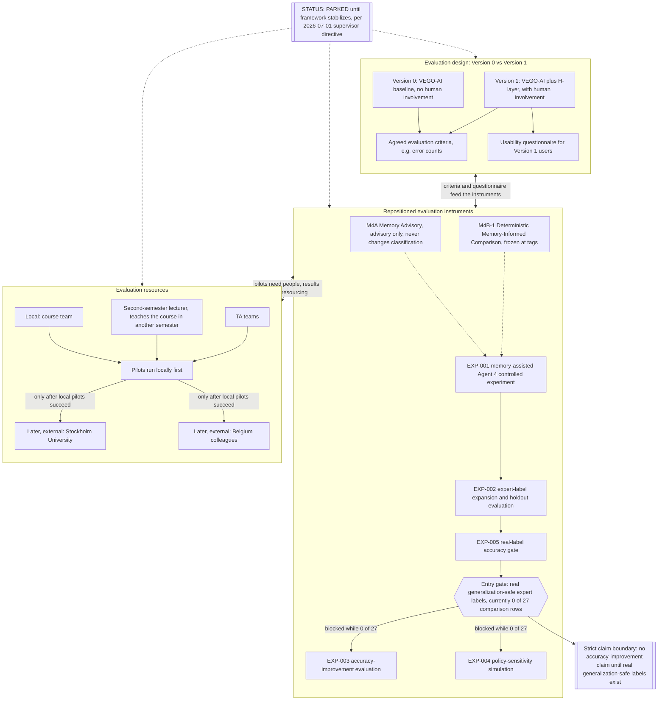

# VEGO-AI Evaluation Track (PARKED)

This diagram implements the evaluation-related directives from the 2026-07-01 supervisor meeting with
Prof. Iris Reinhartz-Berger and Prof. Arnon (notes:
`docs/research/meetings/2026-07-01-supervisor-meeting-iris.md`). Iris invoked the design-science
build-versus-evaluate distinction and directed that everything evaluation-related be moved out of the
framework diagram into this separate diagram, and that evaluation work not proceed until the framework
stabilizes (meeting notes, section 4). The framework itself is shown in
`docs/architecture/framework-diagram.md`.

## Status: PARKED

Per directive, this track is parked until the framework, described in
`docs/architecture/framework-diagram.md`, stabilizes. No evaluation work should proceed ahead of that
milestone, and no accuracy-improvement claim may be made until the real-label gate below is satisfied.

## Reading The Track

- Version 0 versus Version 1 is the core evaluation design Iris asked for: the baseline VEGO-AI framework
  with no human involvement compared against the same framework plus the H-layer, with human involvement,
  on agreed evaluation criteria such as error counts, plus a usability questionnaire collected only from
  Version 1 users (meeting notes, section 4).
- M4A Memory Advisory and M4B-1 Deterministic Memory-Informed Comparison are repositioned here as
  evaluation instruments, not framework components, per Iris's M3-versus-M4 distinction (meeting notes,
  section 6): M3-equivalent judgment memory belongs to the framework as H3, while M4-equivalent
  memory-informed comparison belongs to evaluation and is deferred.
- EXP-001 through EXP-005 are the evidence-generation tooling that feeds this track. EXP-005 is the real-label
  accuracy gate: as of the current project state there are 0 generalization-safe expert labels out of the
  27-row comparison set, so EXP-003 and EXP-004-style accuracy conclusions remain blocked at the gate.
- Local resources (course team, the lecturer who teaches the course in a different semester, TA teams) run
  pilots first; external resources at Stockholm University and in Belgium are later-stage options only
  after local pilots succeed (meeting notes, section 5).
- The strict claim boundary is carried over unchanged from the project's evidence gates: no
  accuracy-improvement claim is permitted until real generalization-safe labels exist, matching the
  `ai_classification_changed = 0` and zero-generalization-safe-labels honesty gates already enforced
  elsewhere in the project.
