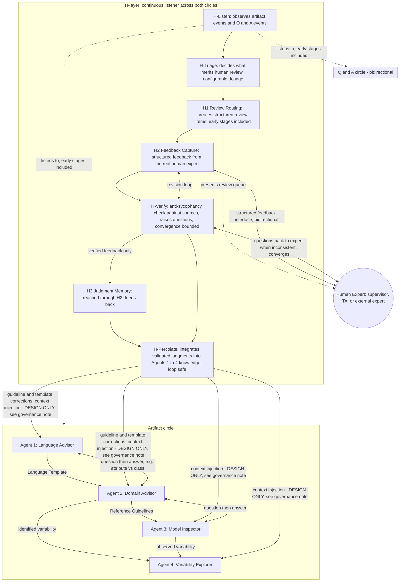

# VEGO-AI Framework With H-Layer (Human Judgment Layer)

This diagram implements the directives from the 2026-07-01 supervisor meeting with Prof. Iris
Reinhartz-Berger and Prof. Arnon (notes: `docs/research/meetings/2026-07-01-supervisor-meeting-iris.md`).
It shows the original VEGO-AI baseline agents, the two communication circles Iris described between them,
and the H-layer (human judgment layer, renamed from M1/M2/M3 to H1/H2/H3 per directive) sitting as a
continuous listener across both circles. Evaluation content is intentionally excluded here; see
`docs/architecture/evaluation-diagram.md` for the parked evaluation track.

## Framework View

## Legend

- Solid arrows (`-->`) inside the Artifact circle: one-directional artifact hand-off between baseline
  agents, as originally described by Iris.
- Double-headed arrows (`<-->`) inside the Q and A circle: bidirectional question-then-answer exchange;
  the answering agent may also refine its own artifact as a result of being asked.
- Dotted arrows (`-.->`): H-layer listening connections into the circles (early stages included, not only
  post-Agent-4) and the review-queue presentation to the human - not new artifact hand-offs.
- Verify-then-store order: expert feedback flows H2 -> H-Verify -> H3, so only verified judgments enter
  Judgment Memory; H-Percolate consumes both H3 memory and H-Verify outcomes (matches
  `docs/research/h-layer/skills-map.md` sections 2 and 4).
- Double-headed arrows between H2/H-Verify and the Human Expert: the human interface must not be
  one-directional (Iris, section 8 of the meeting notes); H-Verify explicitly checks expert input against
  sources and raises questions rather than accepting it uncritically (anti-sycophancy, section 9).
- Per Arnon (section 7), the H-layer's listening is continuous across all agents and every interaction in
  both circles, not just at the end of the pipeline; per Iris and Arnon (section 1), review routing (H1)
  must be available at early stages, not only after Agent 4 has already decided on variability.
- Per Iris (section 8), most arrows in this diagram, at least in early stages, are intentionally
  bidirectional rather than one-directional.

## Governance Note (Design vs. Implementation)

The H-Percolate arrows into Agents 1-4 are DESIGN ONLY. Any percolation output that affects Agent 4
classification inputs (context injection, or template/guideline corrections that change classification
behavior) remains implementation-blocked per `docs/agent-memory/review-state.md` and
`docs/research/strategic-review-and-hardening-plan.md` until real EXP-005 label evidence justifies a
reviewed deterministic policy. The framework must stay runnable with the H-layer in silent mode, which
preserves the unchanged baseline (Version 0 of the parked evaluation track).

## Open Decision (2026-07-15 Meeting)

The H-layer decomposition is an explicit open decision for the 2026-07-15 supervisor meeting, with three
options analyzed in `docs/research/h-layer/skills-map.md` section 6: (A) one H-agent with seven skills;
(B) two agents - an Observer (H-Listen, H-Triage, H1) and an Integrator (H2, H-Verify, H3, H-Percolate) -
which is the current recommendation because it mirrors the two functionality types named in the meeting;
or (C) seven micro-agents. This diagram groups everything under one `HLAYER` box only to show the flow;
that grouping is not a claim about final agent-versus-skill boundaries.
