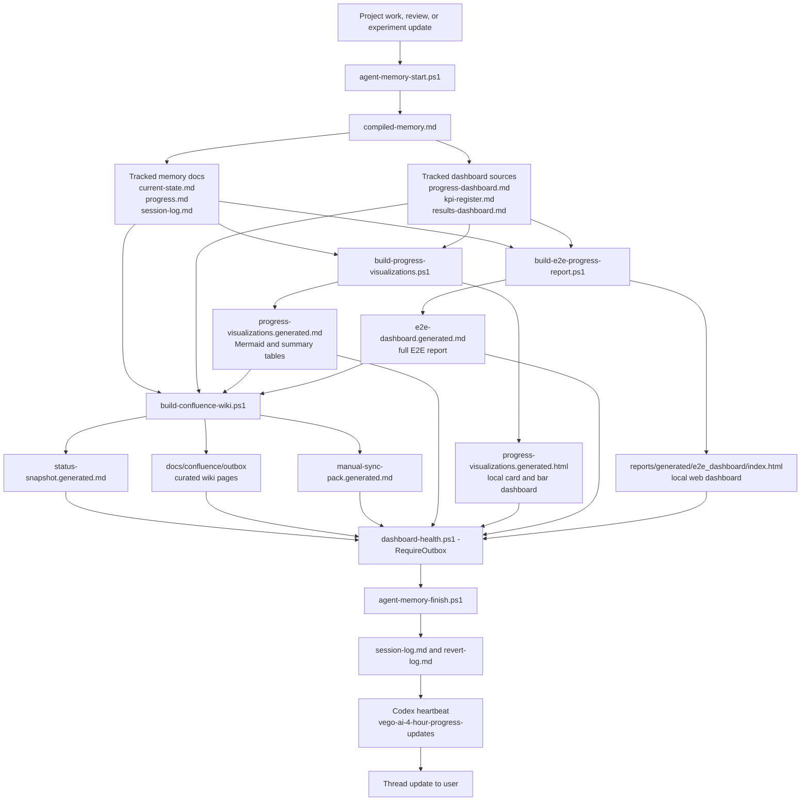
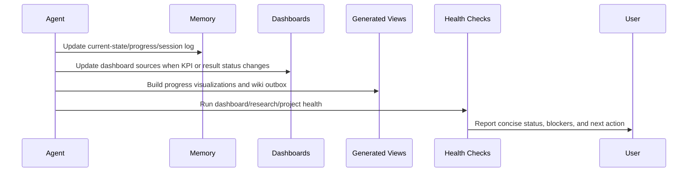

# Progress Update Diagram

This architecture view shows how progress updates move through VEGO-AI from project work to user-facing 4-hour check-ins.

For the operational contract, commands, and guardrails, see `../operations/progress-update-architecture.md`.

## Architecture Flow

## Update Responsibilities

| Component | Responsibility | Tracked |
| --- | --- | --- |
| `docs/agent-memory/current-state.md` | Latest project orientation. | Yes |
| `docs/agent-memory/progress.md` | Milestones, active work, completed work, and next steps. | Yes |
| `docs/dashboards/*.md` | Curated progress, KPI, and result dashboard source pages. | Yes |
| `docs/dashboards/progress-visualizations.generated.*` | Generated local visual views. | No |
| `docs/dashboards/e2e-dashboard.generated.md` | Generated full E2E progress report for Confluence/dashboard tracking. | No |
| `reports/generated/e2e_dashboard/index.html` | Generated local static web dashboard. | No |
| `docs/confluence/outbox/**` | Generated sanitized wiki page bodies. | No |
| `docs/confluence/manual-sync-pack.generated.md` | Generated manual publishing pack. | No |
| `vego-ai-4-hour-progress-updates` | Scheduled thread update automation. | Codex app |

## Minimal Update Path

## Reading Order

1. `project-map.md` for workspace placement.
2. `progress-update-diagram.md` for architecture flow.
3. `../operations/progress-update-architecture.md` for commands, guardrails, and scheduled update rules.
4. `../dashboards/progress-visualizations.generated.html` for the current local visual state.
5. `../../reports/generated/e2e_dashboard/index.html` for the full E2E web dashboard.
