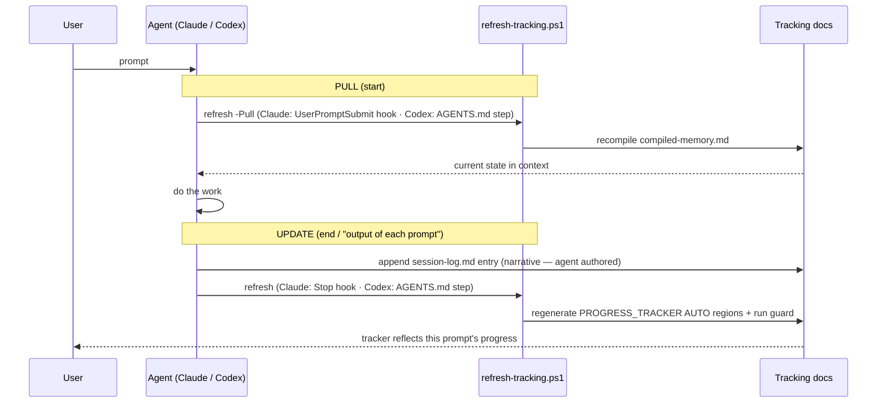

# Thesis Documents & Progress-Tracking Architecture

The complete map of (1) the thesis/research documents, (2) the progress-tracking system, and (3) how both
are **kept current automatically at each prompt** for **Claude and Codex**. This is the single reference for
"where everything lives and how it updates."

---

## 1. Two document layers

### 1.1 Thesis & research documents (the content)
| Area | Location | Role |
| --- | --- | --- |
| Thesis chapters | `thesis/chapters/01..10*.md` | The thesis draft (9/10 drafted; Ch 7 blocked on labels) |
| Thesis outline + draft status | `thesis/outline.md` | Chapter list, evidence map, draft-status tracker |
| Research framing | `docs/research/research-plan.md`, `methodology.md`, `literature-review-taxonomy.md` | Problem, RQ, design-science, taxonomy |
| Evaluation design | `docs/research/evaluation-plan.md`, `evaluation-report.md`, `accuracy-improvement-plan.md`, `expert-labeling-protocol.md`, `m4b1-policy-refinement-plan.md` | How the artifact is evaluated; strict gates |
| Threats / validity | `docs/research/validity-threats.md`, `thesis/chapters/08-*` | Validity handling |
| Paper + claim/evidence | `papers/mas4models2026/claim-evidence-table.md`, the root paper PDF | Source paper + claim bounds |
| Literature pack | `literature/hitl-resource-pack/` (`bibliography.bib`, manifest) | Verified citations for Ch 2 |

### 1.2 Progress-tracking documents (the status)
| Layer | Location | Role |
| --- | --- | --- |
| **Executive view** | `docs/PROGRESS_TRACKER.md` | One-page at-a-glance: phases, milestones, experiments, thesis, gates, critical path. **AUTO regions auto-refreshed.** |
| Chronological detail | `docs/agent-memory/progress.md` | Full milestone/task/completed log |
| Per-prompt history | `docs/agent-memory/session-log.md` | One entry per meaningful prompt (the narrative) |
| Fast orientation | `docs/agent-memory/current-state.md`, `shared-state-report.md`, `review-state.md` | Current state for the next agent |
| Compiled memory | `docs/agent-memory/compiled-memory.md` | Generated concatenation read at prompt start (the "pull") |
| Dashboards | `docs/dashboards/`, `VEGO-AI/reports/results_dashboard/` | KPI + results dashboards (generated) |
| Confluence outbox | `docs/confluence/outbox/` | Generated wiki pages (manual sync) |

---

## 2. Sources of truth vs derived views
Editing discipline depends on the layer:
- **Authored (edit by hand):** thesis chapters, research docs, `session-log.md` narrative, `current-state.md`,
  `progress.md` milestone rows, the hand-written prose of `PROGRESS_TRACKER.md`.
- **Derived (never hand-edit — regenerated):** `compiled-memory.md`; the `<!-- AUTO:* -->` regions of
  `PROGRESS_TRACKER.md` (stamp, phases, labels, invariants, activity); `VEGO-AI/reports/results_dashboard/`;
  dashboards' generated snapshots; Confluence outbox.

> Rule: never hand-edit a derived value the guard can contradict. Authored content drives the numbers;
> generators reflect them.

---

## 3. The generator & guard scripts
| Script | Does | When |
| --- | --- | --- |
| `scripts/agent-memory-start.ps1` | recompiles `compiled-memory.md` (the pull) | prompt start |
| `scripts/agent-memory-finish.ps1` | appends `session-log.md` + `revert-log.md` (the narrative) | prompt end (agent-authored) |
| `scripts/build-progress-tracker.py` | refreshes `PROGRESS_TRACKER.md` AUTO regions from live sources (`--run-tests` for exact pytest count) | prompt end / on demand |
| `scripts/check_evidence_consistency.py` | asserts numeric + frozen-state invariants across all reports | before any claim; prompt end |
| `scripts/refresh-tracking.ps1` | **unified, non-blocking** wrapper: `-Pull` = memory only; default = memory + tracker + guard | hooks + manual |
| `scripts/build-progress-visualizations.ps1`, `build-e2e-progress-report.ps1`, `build-confluence-wiki.ps1` | deeper dashboards / wiki outbox | on demand / periodic |

---

## 4. Per-prompt lifecycle (automatic, both agents)

### 4.1 Claude — automatic via hooks (`.claude/settings.local.json`)
| Hook | Fires | Command |
| --- | --- | --- |
| `UserPromptSubmit` | every prompt start | `pwsh -NoProfile -File scripts/refresh-tracking.ps1 -Pull -Quiet` |
| `Stop` | every prompt end | `pwsh -NoProfile -File scripts/refresh-tracking.ps1 -Quiet` |

These run with no user interaction. The hooks are in the gitignored local settings, so they are personal and
never conflict with Codex.

### 4.2 Codex — same lifecycle via `AGENTS.md`
Codex does not use Claude Code hooks. It follows the documented protocol: run
`.\scripts\refresh-tracking.ps1 -Pull` at prompt start, author the `session-log.md` entry, then run
`.\scripts\refresh-tracking.ps1` at prompt end. The end result is identical derived views.

---

## 5. Honesty note (what "automatic" means)
Two automation layers, both **deterministic (no LLM runs continuously)**:
- **Per-prompt lifecycle** — Claude Code hooks fire on prompt-submit/stop; Codex follows the AGENTS.md
  start/finish steps. Refreshes tracker + guard + visualization fast set each prompt.
- **24/7 file watcher** (`scripts/watch-visualizations.ps1`) — a background process that re-renders diagrams
  and refreshes tracking whenever SOURCE files change (singleton, coalesced, anti-loop). Autostarts at logon
  via the Startup folder (the Scheduled-Task route needs admin and is best-effort). A reboot needs a logon
  for it to relaunch; there is no cross-logon system service.

The only part that cannot be automated is the **narrative `session-log.md` entry** — only the agent knows
what a prompt accomplished, so the agent writes that one line; everything derived from it (tracker,
invariants, compiled memory, diagrams) regenerates automatically.

---

## 6. Ownership & the human gate
The tracking system is fully automated, but the **research critical path is human-gated** (see
`PROGRESS_TRACKER.md` §6): supervisor approval → expert labeling → κ/adjudication → gold labels. Only after
real labels exist does an agent run the evaluation and write Chapter 7. No automation changes that, and none
of it touches Agent 4, the baseline, policy, or makes accuracy claims.

---

## 7. Maintenance / how to extend
- Add a new auto metric: add an `<!-- AUTO:name:start/end -->` region to `PROGRESS_TRACKER.md` and a
  corresponding block in `build-progress-tracker.py` (`replace_region`).
- Add a new invariant: extend `check_evidence_consistency.py`; the tracker stamp reflects PASS/FAIL.
- Heavier refresh (dashboards, wiki): call `build-confluence-wiki.ps1` from `refresh-tracking.ps1` if desired
  (left out by default to keep the per-prompt hook fast).
- Keep this file aligned when the lifecycle or script set changes.
