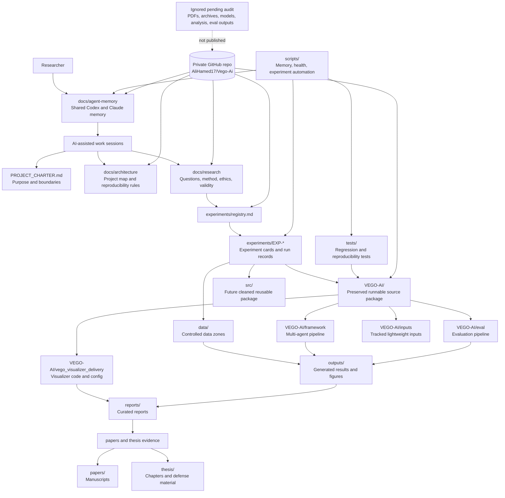

# Workspace Diagram

This diagram shows how the VEGO-AI PhD research workspace is organized across source, research method, experiments, outputs, writing, and shared agent memory.

## Reading The Flow

- Start each AI-assisted session from `docs/agent-memory/`, then use the project charter and architecture docs to choose the right workspace area.
- Keep research questions and experiment protocols outside the preserved `VEGO-AI/` source package.
- Connect source changes and generated outputs back to experiment records before using them as paper or thesis evidence.
- Keep sensitive or bulky artifacts ignored until the data, provenance, and IRB audit is complete.
