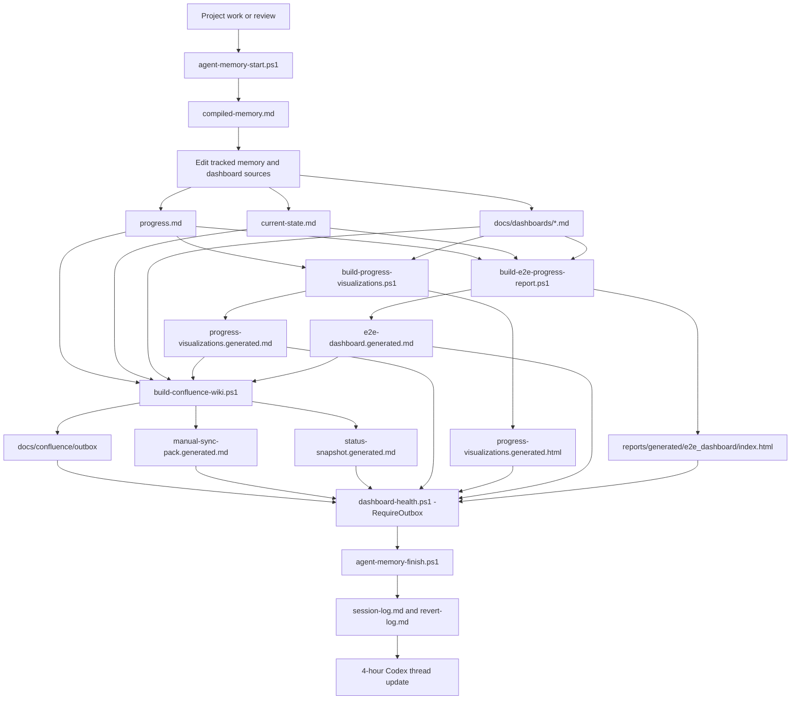
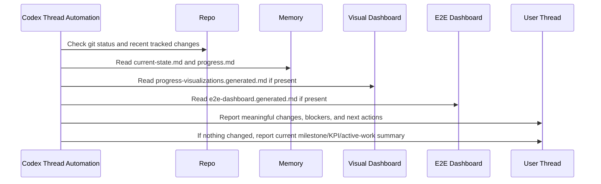

# Progress Update Architecture

This document defines how VEGO-AI progress updates are produced, visualized, checked, and reported back to the user.

The goal is simple: one update path should connect project memory, tracked progress, generated visual dashboards, Confluence outbox pages, and the 4-hour Codex thread check-in.

## Scope

This architecture covers:

- local progress tracking in `docs/agent-memory/progress.md`;
- current project orientation in `docs/agent-memory/current-state.md`;
- dashboard source pages in `docs/dashboards/`;
- generated visual summaries from `scripts/build-progress-visualizations.ps1`;
- the generated full E2E report and local web page from `scripts/build-e2e-progress-report.ps1`;
- generated wiki/outbox refresh from `scripts/build-confluence-wiki.ps1`;
- health verification from `scripts/dashboard-health.ps1`, `scripts/research-health.ps1`, and `scripts/project-health.ps1`;
- 4-hour Codex thread updates from the `vego-ai-4-hour-progress-updates` automation.

It does not replace the research gates. It must not auto-fill expert labels, change Agent 4 behavior, run M4B-2, or claim accuracy improvement without real EXP-005 evidence.

## Update Layers

| Layer | Source | Update Method | Output |
| --- | --- | --- | --- |
| Project memory | `docs/agent-memory/current-state.md`, `docs/agent-memory/progress.md`, session/revert logs | `scripts/agent-memory-start.ps1` and `scripts/agent-memory-finish.ps1` | Shared Codex/Claude state and compiled memory |
| Curated dashboards | `docs/dashboards/progress-dashboard.md`, `kpi-register.md`, `results-dashboard.md` | Manual evidence-backed edits | Stable tracked dashboard sources |
| Generated visuals | Progress, KPI, and dashboard Markdown | `scripts/build-progress-visualizations.ps1` | Ignored Mermaid Markdown and local HTML dashboard |
| E2E report | Memory, dashboard, experiment summary, review state, and Git status sources | `scripts/build-e2e-progress-report.ps1` | Ignored full report plus `reports/generated/e2e_dashboard/index.html` |
| Wiki package | Memory files and dashboard sources | `scripts/build-confluence-wiki.ps1` | Ignored Confluence outbox and manual sync pack |
| Verification | Tracked docs/scripts and generated safe outputs | `scripts/dashboard-health.ps1 -RequireOutbox`, `scripts/research-health.ps1`, `scripts/project-health.ps1` | Pass/fail health verdict |
| Scheduled update | Current thread automation | Codex heartbeat every 4 hours | Short thread update with changes, blockers, and next actions |

## Data Flow



## 4-Hour Update Loop



## Standard Refresh Commands

Run these from the repository root.

Refresh the visual progress dashboard:

```powershell
.\scripts\build-progress-visualizations.ps1
```

Refresh the full E2E progress report and local web page:

```powershell
.\scripts\build-e2e-progress-report.ps1
```

Refresh the wiki outbox, dashboard snapshot, visualizations, and manual sync pack:

```powershell
.\scripts\build-confluence-wiki.ps1
```

Verify the dashboard/wiki package:

```powershell
.\scripts\dashboard-health.ps1 -RequireOutbox
```

Run the broader health checks:

```powershell
.\scripts\research-health.ps1
.\scripts\project-health.ps1
```

## Update Contract

When progress changes:

1. Update `docs/agent-memory/progress.md`.
2. Update `docs/agent-memory/current-state.md` when the latest known state changes.
3. Update `docs/dashboards/` when KPI, result, or dashboard-facing status changes.
4. Run `.\scripts\build-progress-visualizations.ps1`.
5. Run `.\scripts\build-e2e-progress-report.ps1`.
6. Run `.\scripts\build-confluence-wiki.ps1`.
7. Run `.\scripts\dashboard-health.ps1 -RequireOutbox`.
8. Run `.\scripts\agent-memory-finish.ps1` with the summary, changed files, commands, status, next steps, and rollback note.

## 4-Hour Update Content

Each scheduled update should include:

- whether anything material changed;
- current milestone completion, KPI green rate, and active-work closure from `progress-visualizations.generated.md`;
- current review verdict, EXP-005 label gate, and next action from `e2e-dashboard.generated.md`;
- blockers that need the user, especially EXP-005 labels, Confluence access, or data/IRB decisions;
- the next concrete action;
- whether the repo has pending local changes.

It should not repeat long dashboard tables unless the user asks for detail.

## Guardrails

- Generated files under `docs/dashboards/*.generated.*`, `reports/generated/e2e_dashboard/**`, `docs/confluence/outbox/**`, and `docs/confluence/*.generated.md` stay ignored.
- Do not edit generated files directly; update tracked source docs and regenerate.
- Do not run dashboard health in parallel with `build-confluence-wiki.ps1`; the outbox is rewritten during the build.
- Do not publish controlled artifacts, PDFs, model files, generated report contents, or label sheets without approval.
- Do not claim accuracy improvement while EXP-005 has zero valid generalization-safe expert labels.
- If live Confluence access is unavailable, treat the outbox/manual sync pack as the pending wiki update.
