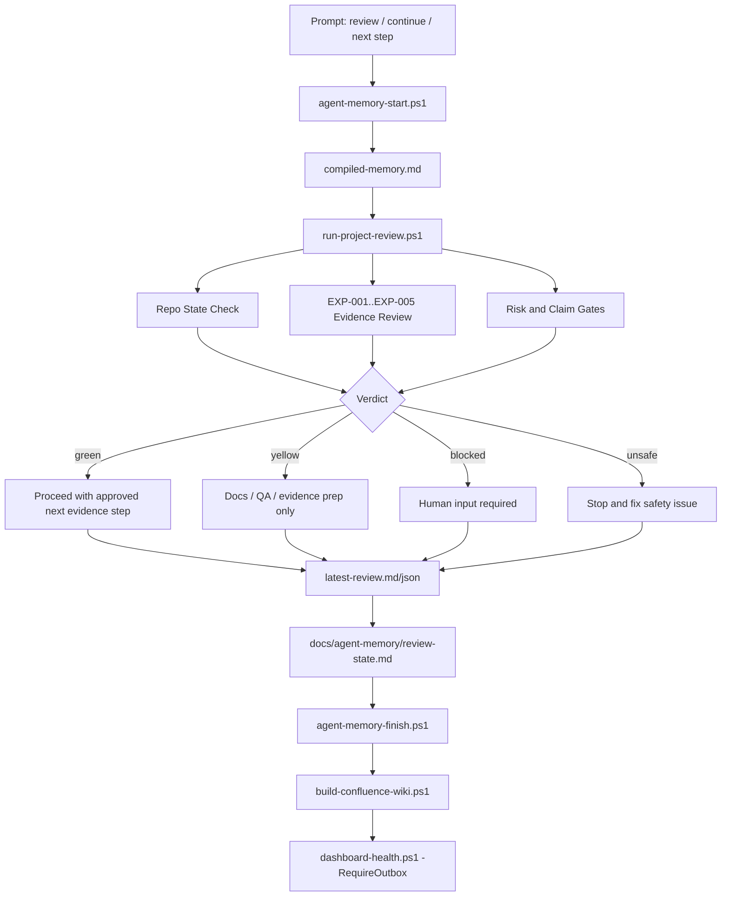

# VEGO-AI Project Review Architecture

This document defines the supervised review architecture for Codex and Claude. It turns "review our work", "continue", and "next step" prompts into a repeatable audit cycle that uses project memory, checks evidence gates, blocks unsafe claims, and records the next action.

The review cycle is not a background service. It is an agent-enforced workflow run once per prompt or by explicit script command.

## Review Layers

| Layer | Purpose | Main Inputs | Main Outputs |
| --- | --- | --- | --- |
| Memory Intake | Load the project state before reasoning. | `docs/agent-memory/*`, `compiled-memory.md` | Shared current state for Codex and Claude. |
| Repo State Check | Detect dirty state, protected diffs, and forbidden tracked artifacts. | Git status, tracked file list, protected path diff | Safety verdict and blockers. |
| Evidence Review | Summarize EXP-001 to EXP-005 and dashboard evidence. | `reports/generated/**`, dashboards, experiment registry | Evidence state and label counts. |
| Risk/Gate Review | Apply strict research gates. | Issues, risk register, EXP-005 label state | Green/yellow/blocked/unsafe verdict. |
| Claim Validation | Separate allowed claims from blocked claims. | Evaluation report, strict gate state | Approved and blocked thesis claims. |
| Next-Step Selection | Pick one actionable next move. | Verdict, blockers, evidence state | Next action for the agent/user. |
| Memory/Confluence Update | Keep future agents and wiki outputs aligned. | Review summary, memory files, wiki builder | Updated memory and pending Confluence outbox. |

## Flow



## Verdict Model

| Verdict | Meaning | Typical Next Action |
| --- | --- | --- |
| `green` | Implementation and evidence are current; next step is allowed. | Run the approved evidence or reporting action. |
| `yellow` | Safe to continue with docs, QA, or evidence preparation, but no accuracy claim. | Prepare/review materials, keep boundaries intact. |
| `blocked` | Human input or external access is required. | Collect real EXP-005 labels, close locked files, or grant access. |
| `unsafe` | A protected path changed, controlled artifact is tracked, or a forbidden boundary is crossed. | Stop and resolve the safety issue before continuing. |

## Standard Commands

Run a project review:

```powershell
.\scripts\run-project-review.ps1
```

Run a review and update tracked review memory:

```powershell
.\scripts\run-project-review.ps1 -UpdateReviewState
```

Run the supervised next-step loop:

```powershell
.\scripts\run-codex-next-step.ps1 -RefreshWiki -RunHealth -NoOpen
```

Open the local workbench:

```powershell
.\scripts\open-vego-workbench.ps1 -SkipGenerate
```

## Non-Negotiable Boundaries

- Do not invent or auto-fill expert labels.
- Do not treat synthetic labels or same-pattern memory as real accuracy evidence.
- Do not implement M4B-2, Agent 4 changes, embeddings, LLM/API reclassification, baseline overwrites, or `VEGO-AI/eval_output` changes.
- Do not publish controlled PDFs, models, analysis outputs, generated reports, or label sheets without data/IRB and publishability approval.
- Do not claim classification accuracy improvement until real generalization-safe EXP-005 labels support that claim.
