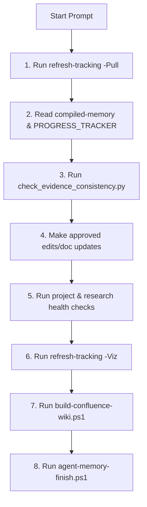

# VEGO-AI PhD Review and Alignment Playbook

This playbook defines the operational standards and validation checks to maintain strict research and software alignment across the VEGO-AI MSc baseline preservation and the PhD doctoral continuation tracks (including the **MediVARIA** clinical guideline adherence transfer).

---

## 1. The Daily Prompt Loop (Step-by-Step)

Every agent (Claude/Codex) must execute this validation loop to ensure memory and codebase health:



### Detailed Commands:
1. **Pull fresh memory:**
   ```powershell
   .\scripts\refresh-tracking.ps1 -Pull
   ```
2. **Verify current evidence consistency:**
   ```powershell
   python scripts/check_evidence_consistency.py
   ```
3. **Execute modifications:** Ensure modifications comply with branch rules (see Section 2).
4. **Run health validation suite:**
   ```powershell
   .\scripts\project-health.ps1
   .\scripts\research-health.ps1
   python -m pytest VEGO-AI\tests -q
   ```
5. **Re-compile and visualize progress:**
   ```powershell
   .\scripts\refresh-tracking.ps1 -Viz
   ```
6. **Generate Confluence outbox:**
   ```powershell
   .\scripts\build-confluence-wiki.ps1
   .\scripts\dashboard-health.ps1 -RequireOutbox
   ```
7. **Commit prompt summary to memory:**
   ```powershell
   .\scripts\agent-memory-finish.ps1 -Agent "AgentName" -Title "Task Title" -Request "User Request" -Actions "Action 1", "Action 2" -Commands "Cmd 1" -SkipRevertLog
   ```

---

## 2. Codebase & Branching Alignment Gates

To preserve the MSc baseline while testing new features, the following branch and path controls are strictly enforced:

* **Protected Paths (M4B and Framework Core):**
  * `VEGO-AI/framework/`
  * `VEGO-AI/schemas/`
  * `VEGO-AI/tests/`
  * `VEGO-AI/eval/`
  * `VEGO-AI/inputs/`
  * `VEGO-AI/docs/memory_*`
  * `VEGO-AI/docs/*advisor*`
* **Direct Commit Rules:**
  * **Main (`main`):** Direct commits are allowed ONLY for documentation, literature reviews, progress logs, dashboards, and meeting notes.
  * **Feature Branch (`feature/`):** All framework code changes, experimental policies, or classifier modifications must be written to a feature branch and merged via a reviewed Pull Request.
* **Overwriting Baseline Outputs:**
  * Under no circumstances should `VEGO-AI/eval_output/` or baseline advisor outputs be overwritten on `main`. Parallel comparison files (e.g. `memory_informed_comparison.json`) must be used instead.

---

## 3. Evaluation & Claim Verification Gates (EXP-005)

Empirical evaluation results must be protected from bias and premature reporting:

* **The Real-Label Gate:**
  * Quantitative accuracy or F-score improvements are **blocked** unless at least **20 generalization-safe, expert-labeled rows** exist in the `EXP-005` system.
  * If labels = 0, the reporting output must strictly display:
    > "Accuracy improvement cannot be evaluated yet."
  * Synthetic labels (marked with `SYNTHETIC_NOT_HUMAN`) may only be used for simulation testing (e.g. `EXP-004`) and must be strictly isolated from the evidence reporting.
* **Leakage Avoidance:**
  * Judgments matching the same evaluation pattern must be flagged as `same_pattern_memory_used` and excluded from generalization claims.

---

## 4. Clinical Data Governance & MediVARIA Rules

When preparing plans or specs for the medical-domain transfer (**MediVARIA**), the following constraints apply:

* **Zero Patient Data Rule:**
  * **No patient data of any kind** may be added to this repository. This includes raw EHR, public de-identified datasets, synthetic patients, or mock clinical records.
  * Medical domain proposal/partner files (e.g., `.docx` proposal briefs) must be explicitly ignored via `.gitignore` or `.antigravityignore` and never staged.
* **Clinician Decision Authority:**
  * The physician is the absolute authority. MediVARIA operates as decision support; clinicians are never simulated, and clinical guidelines may never be altered autonomously.
* **Haifa IRB Pre-Flight Checklist:**
  * Before beginning any retrospective de-identified data pilot, a Haifa University IRB application path must be documented, specifying the ethical approval boundaries.

---

## 5. Confluence Outbox Sync Audits

Since live cloud sync is restricted due to Atlassian credentialing:
* Always audit the generated manual sync files located in `docs/confluence/outbox/`.
* Run `.\scripts\dashboard-health.ps1 -RequireOutbox` to verify that status snapshots, KPI logs, and progress diagrams are fully built before declaring a wiki update complete.
