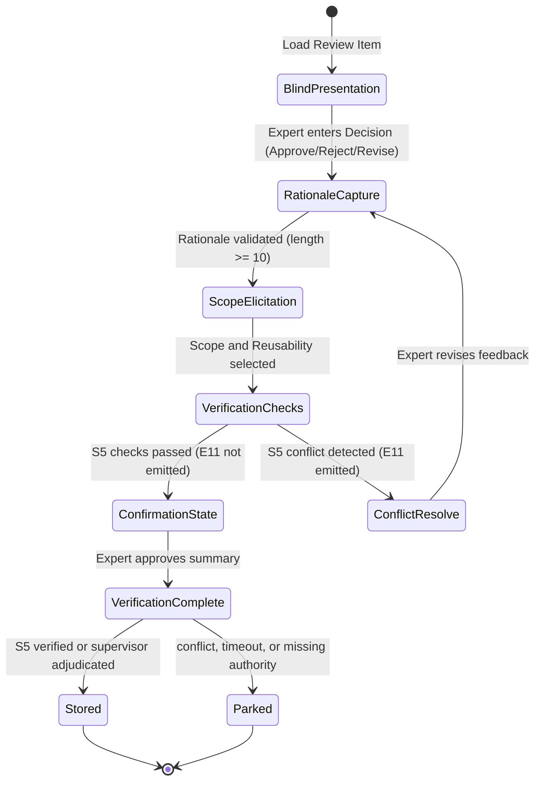

# S4 Structured Feedback Elicitation Interface Specification

Status: **PROVISIONAL WORKING DRAFT.** M-04 and M-05 have not been recorded. This document does not define a live interface or authorize writes to trusted memory.

This document proposes the schema, fields, validation requirements, and interaction dialogue states for H-Layer Skill S4 (Capture Feedback).

---

## 1. Structured Feedback Schema

All human expert entries are captured as structured JSON records conforming to the `human_feedback.schema.json` family:

```json
{
  "$schema": "http://json-schema.org/draft-07/schema#",
  "title": "HumanFeedbackRecord",
  "type": "object",
  "properties": {
    "review_id": { "type": "string", "description": "Matches the source review item ID." },
    "review_signature": { "type": "string", "description": "SHA-256 hash of the baseline model state to verify integrity." },
    "reviewer_id": { "type": "string", "description": "Unique identifier of the expert (e.g. TA_01, PROF_IRIS)." },
    "decision": {
      "type": "string",
      "enum": ["approve", "reject", "revise"],
      "description": "Expert ruling on the model element/variability."
    },
    "rationale": {
      "type": "string",
      "minLength": 10,
      "description": "Expert explanation justifying the decision."
    },
    "confidence": {
      "type": "number",
      "minimum": 0.0,
      "maximum": 1.0,
      "description": "Expert self-rated confidence in this judgment."
    },
    "reusable": {
      "type": "boolean",
      "description": "If true, this feedback can be generalized and applied to future cases."
    },
    "validity_scope": {
      "type": "string",
      "enum": ["case_specific", "pattern_specific", "domain_specific", "general"],
      "description": "The applicability limit of the reusable judgment."
    },
    "timestamp": { "type": "string", "format": "date-time" }
  },
  "required": ["review_id", "review_signature", "reviewer_id", "decision", "rationale", "confidence", "reusable", "validity_scope", "timestamp"]
}
```

---

## 2. Interaction Dialogue States

The interface operates as a state machine guiding the expert through the review.



### 1. Blind Presentation State
* **Rule:** The expert is shown the model segment (diagram source), the relevant domain description, and the guideline text.
* **Biasing Safeguard:** The original AI classification and compliance vector scores are hidden from initial view (the expert decides "blind" first) to prevent anchoring bias. The AI's position can be optionally toggled open after the expert inputs their initial decision.

### 2. Decision and Rationale Capture State
* **Decision Input:** Approve / Reject / Revise selection.
* **Rationale Input:** Text area.
* **Validation Rule:** If the decision is `reject` or `revise`, the interface enforces a minimum of 10 characters for the rationale. Rationale-free negative inputs are blocked.

### 3. Scope and Reusability Elicitation State
* **Reusability prompt:** "Can this decision be reused to resolve similar guideline conflicts?" (Yes/No).
* **Scope dropdown:** Select scope level (`case_specific`, `pattern_specific`, `domain_specific`, `general`).

### 4. Confirmation State
* **Logic:** The interface displays a final summary card of the feedback record.
* **Action:** The expert confirms the captured record. Confirmation does not itself transition the record to trusted H3 storage. Only an S5-verified or explicitly supervisor-adjudicated record may produce E12; timeout, rejection, unresolved conflict, or missing authority is parked.
