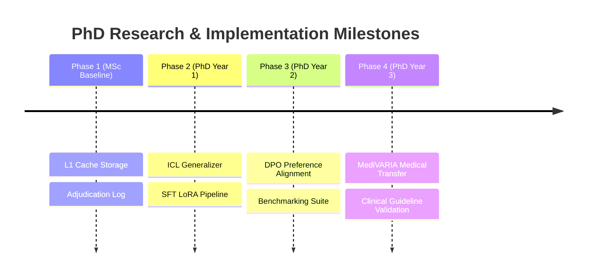

# H-Layer Feedback Learning & Alignment: Retrieval to Preference Optimization

This document outlines the research plan and architecture for transitioning the Human-in-the-Loop (HITL) layer from simple caching (retrieval-based memory) to advanced learning paradigms. It addresses key supervisor requirements (Prof. Iris) regarding reasoning, generalization, and learning from expert feedback using reinforcement learning and instruction-tuning concepts.

---

## 1. The Retrieval-to-Learning Paradigm Shift

Currently, the Human-in-the-Loop layer operates as an **L1 Cache (Retrieval-Based Memory)**. Rulings and guideline overrides are indexed and matched against identical or near-identical subjects:

```
[Expert Feedback] ---> [Feedback Memory Store (L1 Cache)] ---> [Lookup Matcher] ---> [Informed Agent]
```

### Limitations of Retrieval Caching
1. **No Out-of-Distribution (OOD) Generalization:** If a new case exposes an unmodeled variation pattern, the retrieval cache cannot apply historical reasoning because the exact pattern key is missing.
2. **Context Window Expansion:** Storing a linear backlog of raw feedback logs increases context overhead and query latencies.
3. **No Behavioral Alignment:** Caching updates the data, not the baseline model’s default classification policy. The model remains prone to the same structural biases unless explicitly override-guided.

### Parametric Feedback Learning (L2 Learning)
To solve these limitations, we transition the feedback mechanism to **L2 Learning**, where feedback is distilled into model parameters or generalized prompt instructions:

```
[Expert Feedback] ---> [Generalization Engine] ---> [SFT / DPO Alignment] ---> [Aligned Advisor Policy]
```

---

## 2. Dynamic Learning Vectors

We propose three distinct learning pathways representing progressive research complexity.

### Vector 1: Meta-Instruction Synthesis (In-Context Learning - ICL)
A lightweight pathway that requires no model training, utilizing LLM synthesis to condense feedback.

* **Mechanism:** 
  1. Periodically, a **Generalization Agent** scans the `hlayer_prototype_feedback.json` logs.
  2. The agent groups feedback by setting and pattern, prompting a high-capacity model:
     ```
     Given the following expert corrections and rationales:
     - Expert rejected template adjustment because of mismatched braces in {construct}.
     - Expert approved override for pattern X because of context rule Y.
     Synthesize these into 3 concise, human-readable guidelines.
     ```
  3. The synthesized guidelines are automatically appended to Agent B's system prompt.
* **Pros:** Fast implementation; highly interpretable; zero training cost.
* **Cons:** Bound by prompt context constraints; vulnerable to context-drift and prompt injection.

### Vector 2: Continuous Instruction Fine-Tuning (SFT)
Translates expert actions directly into instruction-tuning datasets to update model weights.

* **Mechanism:**
  1. Convert feedback records into instruction-response training tuples:
     * **Input (Prompt):** The original context, case details, and the incorrect agent prediction.
     * **Output (Target):** The expert-corrected classification along with the normalized rationale.
  2. Perform parameter-efficient fine-tuning (e.g., LoRA) on the local advisor models using a small-batch instruction training loop.
* **Pros:** Hardens the model's baseline classification policy; runs completely offline.
* **Cons:** Risk of catastrophic forgetting on general domain tasks; requires labeled training sets.

### Vector 3: Direct Preference Optimization (DPO)
Leverages both correct and incorrect outputs to align the models directly with expert preferences.

* **Mechanism:**
  1. Construct preference pairs from the feedback logs:
     * **Prompt ($x$):** Agent communication circles and case specifications.
     * **Winning Response ($y_w$):** The human expert's corrected ruling/rationale.
     * **Losing Response ($y_l$):** The original incorrect agent prediction.
  2. Optimize the advisor policy model ($\pi_\theta$) directly using the DPO loss function:
     $$\mathcal{L}_{\text{DPO}}(\pi_\theta; \pi_{\text{ref}}) = -\mathbb{E}_{(x, y_w, y_l)}\left[\log \sigma \left(\beta \log \frac{\pi_\theta(y_w|x)}{\pi_{\text{ref}}(y_w|x)} - \beta \log \frac{\pi_\theta(y_l|x)}{\pi_{\text{ref}}(y_l|x)}\right)\right]$$
* **Pros:** Directly aligns model behavior to preference boundaries; mathematically robust.
* **Cons:** High computational complexity; requires stable reference policy models ($\pi_{\text{ref}}$).

---

## 3. Generalization & Evaluation Metrics

To measure learning effectiveness, the framework evaluates three KPI categories:

### M-G1: Generalization Accuracy
* **Definition:** Classification accuracy delta on a held-out set of unseen variation patterns.
* **Target:** Achieve $\ge 85\%$ accuracy on held-out patterns after learning from related patterns.

### M-G2: Sample Efficiency
* **Definition:** The number of expert feedback samples ($N$) required to eliminate systematic errors.
* **Target:** Reach $90\%$ alignment convergence within $N \le 50$ expert corrections.

### M-G3: Catastrophic Forgetting Guardrail
* **Definition:** Regression rate on baseline benchmarks (e.g., general software engineering templates or compliance checks) post-tuning.
* **Target:** Baseline benchmark regression rate $\le 2\%$.

---

## 4. Phased PhD Research Milestones



### Phase 1: MSc Baseline (Completed)
* Implement S1-S3 listener hooks and L1 retrieval-based cache memory.
* Set up mock verification check logs and automated regression suites.

### Phase 2: PhD Year 1 (In-Context Generalization & SFT)
* Develop the offline **Generalization Agent** for Vector 1 (ICL meta-rule synthesis).
* Build the dataset generator script formatting feedback logs into instruction datasets.
* Implement a local LoRA SFT script and test parameter updates on advisor policies.

### Phase 3: PhD Year 2 (Preference Alignment & DPO)
* Develop preference pair generators from override logs.
* Implement DPO training loops on reference models.
* Evaluate generalization metrics (M-G1) and safety retention (M-G3) to establish a trade-off curve.

### Phase 4: PhD Year 3 (MediVARIA Transfer)
* Transfer the aligned feedback pipeline to clinical guideline compliance checks (TRL 5).
* Validate preference learning using mock clinical datasets and physician feedback loops.
