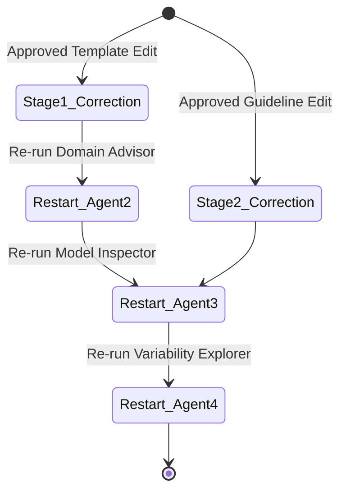

# S6 Early-Stage Integration and Feedback Specification

Status: **PROVISIONAL WORKING DRAFT.** M-02 and M-05 have not been recorded. S6 is proposal-only: it cannot mutate an artifact, prompt, context, classification, or runtime path.

This document proposes correction-proposal targets and loop-safety requirements for H-Layer Skill S6 (Integrate). Live propagation and pipeline re-triggering are outside the authorized phase.

---

## 1. Outbound Propagation Matrix

When S5 verifies feedback that may imply a correction, S6 may create an E14 `CorrectionProposal`. It records the target artifact hash, proposed diff, supporting evidence, rollback description, and approval state. Phase one stops at the proposal; nothing is delivered into an agent execution context.

| Target Agent | Artifact Affected | Proposed future delivery interface | Phase-one output |
| --- | --- | --- | --- |
| **Agent 1 (Language)** | Language Template (E1) | Prompt/context proposal | Reviewable diff only; no prompt mutation. |
| **Agent 2 (Domain)** | Reference Guidelines (E4) | Guideline proposal | Reviewable diff only; no CSV mutation. |
| **Agent 3 (Inspector)**| Compliance context (E5) | Case-context proposal | Reviewable diff only; no context injection. |
| **Agent 4 (Explorer)** | Variability context (E8) | Advice proposal | Parked; no Agent 4 or classification effect. |

---

## 2. Future Pipeline Re-Triggering (Not Authorized)

The state diagram below documents a possible future dependency path only. Approval of a correction proposal does not authorize a rerun, and this phase implements no active correction or pipeline re-triggering.

### Safety Guards Required Before Any Future Implementation
Any separately authorized re-triggering design would need at least these invariants:
1. **Idempotency Guard:** S6 compares the hash of the proposed change with previous modifications. If a proposed change matches an already applied context edit, S6 blocks the change and flags it as `duplicate_propagation_aborted`.
2. **Iteration Cap:** The value of any future cap is an open M-05 design parameter, not the S5 question-round proposal and not a current default.
3. **Early Exit on No-Change:** If a re-run of a stage yields the exact same compliance outputs as the previous run, S6 immediately terminates the loop and does not run downstream agents.

Until a separate implementation authorization exists, the acceptance condition is simpler: source artifacts and baseline outputs remain byte-for-byte unchanged.
