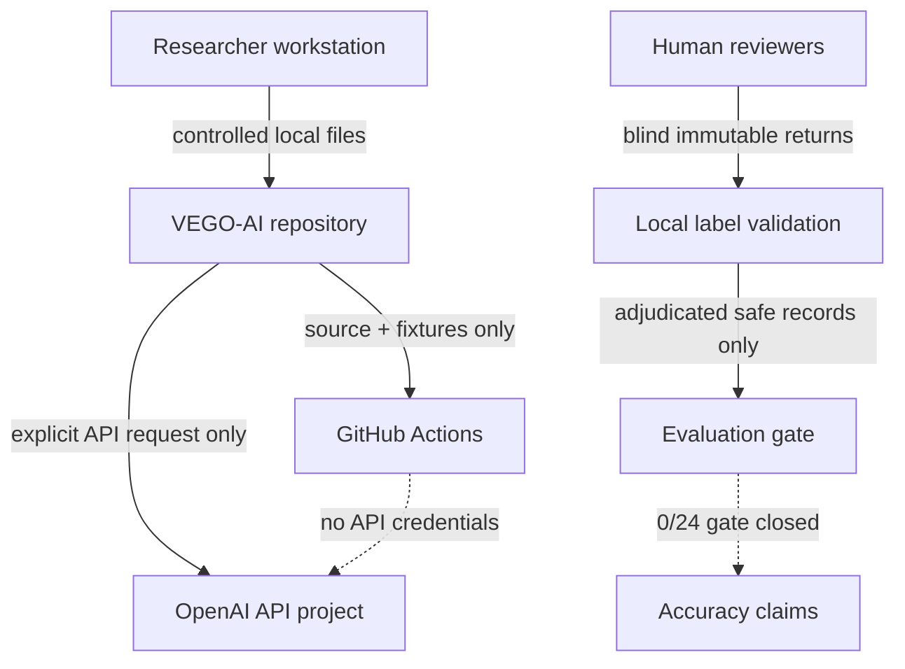

# VEGO-AI Threat Model and Privacy Boundary

## Security objective

Protect research participants, credentials, controlled evidence, the frozen
baseline, and release provenance without changing Agent 4 behavior.

## Assets

| Asset | Sensitivity | Required protection |
| --- | --- | --- |
| OpenAI and GitHub credentials | Critical | Environment/project secret only; never logged or committed |
| Student models and domain descriptions | Confidential research data | Local controlled storage and minimization |
| Human feedback and expert labels | Confidential research data | Reviewer provenance, immutable raw records, access control |
| Supervisor transcript/materials | Confidential | Raw media/ASR excluded from Git; reviewed excerpts only |
| Baseline Agent 4 outputs | Research-integrity critical | Byte lock plus semantic tag mapping; read-only |
| HTML, DOCX, PPTX, PDF, ZIP | Publication artifact | Path/privacy scan, magic-byte check, archive traversal limits |
| GitHub Actions | Supply-chain boundary | Minimal permissions, SHA-pinned actions, API-free PR jobs |
| JSON, JSONL, CSV, ZIP, config paths | Untrusted input | Schema, size, count, traversal, and overwrite validation |

## Trust boundaries

## Threats and controls

| Threat | Control | Failure state |
| --- | --- | --- |
| Plaintext API key | Constructor and config checks reject it | Stop before request |
| Secret in source/history | Pattern scan across tree and Git history | Block PR/release |
| Prompt/response disclosure | `metadata_only` default; full content explicit, redacted, local | No raw content by default |
| Unlimited logs | Size rotation, bounded backups, 30-day retention | Old backup removed |
| Dependency compromise | Frozen `uv.lock`/`package-lock.json`, audit, SBOM | High/direct vulnerability blocks |
| Mutable CI action | Full commit-SHA pins | Workflow review fails |
| Path traversal/symlink | Resolved-root allowlist and symlink rejection | Input/output rejected |
| Archive traversal/zip bomb | Member path, expanded size, compression-ratio checks | Artifact rejected |
| Baseline drift | Tag semantic lock, current byte lock, protected allowlist | Release blocked |
| Evidence leakage | Leakage class and safe-label schema invariants | Metric remains null |
| Synthetic-as-human evidence | Synthetic reviewer IDs forbidden | Record invalid |
| Parity regression | Legacy publication on mismatch | Unified result not published |

## Interaction logging

`metadata_only` records prompt/response hashes and lengths, requested and
returned model identifiers, SDK version, configuration hash, parameters, token
usage, retry count, parse/API errors, timestamp, and fingerprint when returned.
It does not store prompt or response text.

`full_content` is an explicit opt-in. It emits a warning, applies best-effort
secret redaction, rejects UNC/network paths, and uses bounded local retention.
It is not appropriate for controlled participant content without a separately
approved data-management decision.

## Residual risks

- Historical GPT-4o calls used an alias; the exact served snapshot is unknown.
- Best-effort redaction cannot prove all sensitive text has been removed.
- GitHub branch protection depends on the repository plan and human setup.
- Local malware scanning is operating-system dependent and remains a release
  operator step.
- EXP-005 has no independent labels; security hardening does not improve the
  empirical evidence level.
