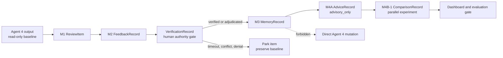
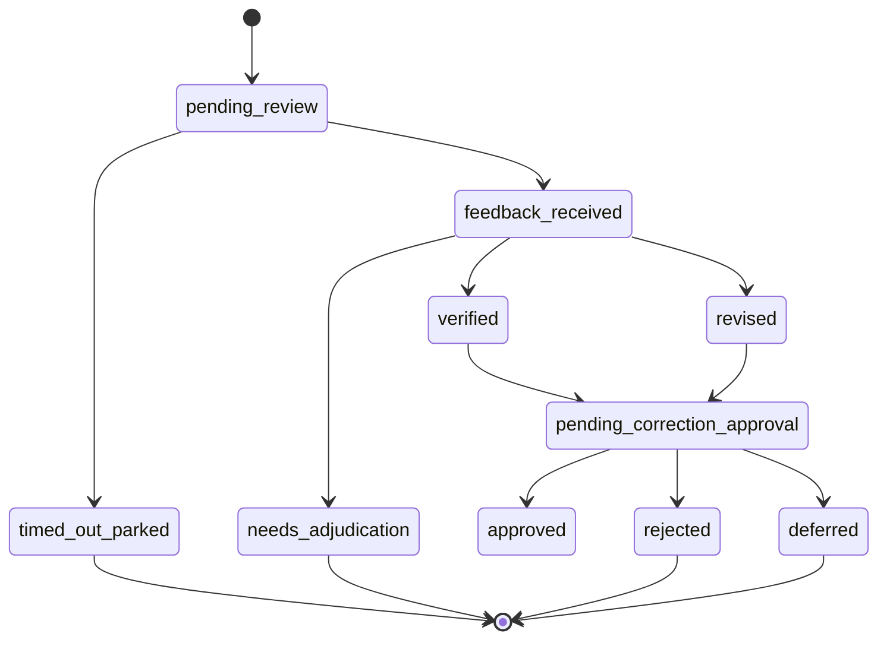

# Unified H-Layer Runtime Architecture

## Scope

The unified runtime is an additive internal architecture for M1–M4B-1. Legacy
mode remains the default. Agents 1–4, Agent 4 policy, prompts, classifications,
original evaluation logic, and `eval_output` remain outside the change
allowlist.

## Runtime modes

| Mode | Purpose | Publication rule | Failure behavior |
| --- | --- | --- | --- |
| `legacy` | Preserve the current M1–M4B-1 execution | Publish the historical artifact | Existing behavior |
| `unified` | Validate and serialize through canonical contracts | Publish only when the normalized public artifact is unchanged | Reject semantic drift |
| `parity` | Compare legacy and unified representations | Publish legacy on match or mismatch | Report mismatch and fail closed |

The configured default is `legacy`. Switching modes is explicit; no PR in this
release silently changes the default.

## Unified component flow

## Canonical contract catalog

| Contract | Responsibility | Required invariant |
| --- | --- | --- |
| `ObservationRecord` | Provenance-aware E1–E15 event | Missing visibility remains explicit |
| `TriageDecision` | Routing, severity, dosage, bundling | E15 is parked; no framework action |
| `ReviewItem` | Self-contained human question | Stable review identity and provenance |
| `FeedbackRecord` | Structured human response | Signature, reviewer, rationale, scope |
| `VerificationRecord` | Deterministic-first evidence check | Conflict ends in adjudication, not approval |
| `MemoryRecord` | Reusable judgment | Only verified/adjudicated records are trusted |
| `AdviceRecord` | Retrieved advisory evidence | `advisory_only`; classification unchanged |
| `CorrectionProposal` | Reviewable proposal | Never applies a mutation |
| `ComparisonRecord` | Parallel M4B-1 result | Baseline behavior remains false |
| `ArchitectureRunManifest` | Mode/parity provenance | Input, legacy, unified, and published hashes |
| `ExperimentRunManifest` | Offline experiment provenance | Inputs, outputs, decisions, metrics, claim scope |

Historical M3 records are marked `legacy_mechanism_memory`. They remain valid
mechanism evidence but are not retroactively described as S5-verified.

## Authority state machine

Timeout, missing evidence, unresolved conflict, denial, and rejection preserve
the original baseline and create no trusted-memory write.

## Adapter and parity rules

Each legacy artifact is deep-copied, mapped into canonical records, validated,
and converted back to the public legacy shape. Parity normalizes only
`created_at`, `generated_at`, and `run_id`. It compares record identifiers,
signatures, statuses, memory matches, advice, classifications, escalation
flags, safety fields, and row counts.

The controlled gate currently confirms:

- 14 M1–M4B-1 artifacts across four settings.
- 11 review items.
- 3 historical mechanism-memory records.
- 27 comparison rows.
- 0 classification changes.
- byte-stable legacy/unified normalized outputs.

These are reliability and compatibility results only.

## Filesystem boundary

The unified CLI:

- rejects symbolic-link inputs and outputs;
- enforces a 25 MiB input and 100,000-record ceiling;
- restricts outputs to generated reports, artifacts, local run storage, or the
  operating-system temporary directory;
- refuses `.git` and `eval_output`;
- refuses silent overwrite;
- writes through a temporary file and atomic promotion.

Legacy CLIs retain their historical public paths. Their outputs are still
checked by the evidence, baseline, and protected-change gates.
