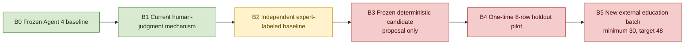
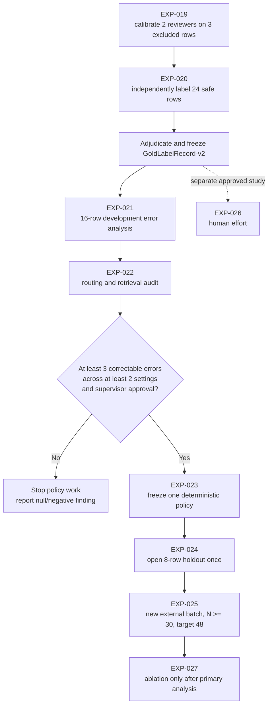

# Thesis Accuracy-Evidence Advancement Plan

Date: 2026-07-24
Status: **Approved for evidence-safe planning and evaluation infrastructure; no policy or runtime change approved.**

## 1. Outcome

The aim is not to guarantee a positive result. The aim is to make any later
accuracy statement auditable, leakage-safe, paired against the frozen baseline,
and robust to reviewer disagreement. The project can already demonstrate the
reusable-human-judgment mechanism. It cannot yet demonstrate that the mechanism
improves classification accuracy, generalizes, or reduces human effort.

The next phase therefore advances five baselines:

No stage overwrites the original baseline. B3-B5 remain parallel evaluations.

## 2. Current verified baseline

| Evidence | Current value | Interpretation |
| --- | ---: | --- |
| Student models | 179 | Scale description, not an independently labeled test set |
| Agent 4 patterns | 27 | Frozen comparison universe |
| Agent 4 classes | 9 Substantial, 18 Occasional, 0 Undetermined | Baseline output distribution |
| Human-review queue | 11 items | Observed prototype count, not a proven effort reduction |
| Reusable judgments | 3 | Same-pattern mechanism evidence only |
| Memory-advice items | 8 | Retrieval availability; independent relevance pending |
| Comparison rows | 27 | Complete non-destructive comparison coverage |
| Memory-informed changes | 0 | Current policy cannot create an accuracy delta |
| Review-after-memory flags | 2 | Escalation mechanism; precision/recall pending |
| Generalization-safe labels | 0 / 24 | Binding empirical gate |

Latest accepted H-layer state remains Iteration 14,
`hlayer-20260720T173308Z-d79047f5e2`, verdict `NEUTRAL`,
reliability-only. It selects no routing, verification, authority, or policy
default.

## 3. Evaluation questions

### E-RQ1 — Baseline errors

Where, and in which error categories, does the frozen Agent 4 baseline disagree
with independent expert judgment?

Required evidence: two independent reviewers, adjudication, a sealed split, and
development-only error characterization.

### E-RQ2 — Targeting and retrieval

Do selective review and memory retrieval focus attention on expert-identified
baseline problems with relevant, scope-correct, traceable evidence?

Required evidence: routing precision/recall, missed-review analysis, retrieval
relevance, conflict rate, and scope correctness.

### E-RQ3 — Unseen paired effect

Does a frozen deterministic parallel policy produce positive net correction on
unseen, leakage-safe data while preserving baseline safety?

Required evidence: a policy frozen from development-only evidence, a one-time
sealed holdout, and an external education-domain replication.

## 4. Hypotheses

| ID | Hypothesis | Current state | Decisive experiment |
| --- | --- | --- | --- |
| H1 | Selective review contains a meaningful share of expert-confirmed baseline errors. | Unproven | EXP-021/022 |
| H2 | Human Judgment Memory retrieves relevant, scope-correct prior judgments. | Unproven | EXP-022 |
| H3 | A frozen deterministic parallel policy has positive net correction on unseen data. | Unproven and blocked | EXP-024/025 |
| H4 | Reuse reduces repeated review effort without reducing escalation quality. | Unproven and not approved | EXP-026 |

## 5. Experiment chain

### EXP-019 — Reviewer calibration

Use the three same-pattern rows that are already excluded from every
generalization metric. Reviewers label them independently, discuss
disagreements, and clarify the protocol. Their calibration labels are never
copied into the evaluation gold set.

### EXP-020 — Independent labeling

Two reviewers independently label all 24 blinded safe rows. AI outputs, memory
advice, leakage status, and partition assignment remain hidden. Cohen's kappa is
computed before adjudication. A third role adjudicates disagreements while the
two raw returns remain immutable.

### EXP-021 — Baseline error characterization

Open only the 16 development labels. Characterize baseline errors by class,
setting, error type, confidence, and rationale. The eight holdout labels remain
sealed. This experiment answers E-RQ1 and may finish with no correctable errors.

### EXP-022 — Routing and retrieval audit

Test whether review triggers and memory retrieval correspond to the
expert-identified development errors. Report precision, recall, false alarms,
missed errors, retrieval relevance, scope correctness, conflicts, and
same-pattern leakage separately.

### EXP-023 — Deterministic policy development

Proceed only when development evidence shows at least three potentially
correctable errors across at least two settings and the supervisor approves a
specific deterministic candidate. Freeze the rules, input hashes, policy hash,
fallback behavior, and claim boundary in `PolicyCandidateRecord-v1`.

### EXP-024 — Sealed holdout pilot

After policy freeze, open the eight holdout labels once. Report the paired
correctness matrix and net correction. Do not tune after opening. Regardless of
the result, describe it as an eight-row pilot.

### EXP-025 — External replication

Apply the same frozen policy to a new education-domain batch with at least 30
and preferably 48 independently adjudicated patterns. This is the only planned
gate capable of supporting a formal improvement claim.

### EXP-026 — Human effort

Measure review time, repeated questions, reviewer confidence, and escalation
quality in a separately consented, controlled workflow. Queue counts alone are
not evidence of time savings.

### EXP-027 — Ablation and robustness

After the primary external analysis, evaluate predeclared ablations and
sensitivity. Ablation cannot tune the external result or rescue a failed
primary gate.

## 6. Metrics

### Primary

`net correction = changed-and-correct - changed-and-wrong`

Net correction directly measures the paired benefit and harm of changing a
classification. Accuracy and macro-F1 remain important but can hide whether a
policy introduced harmful changes.

### Secondary

- Original and candidate accuracy.
- Original and candidate macro-F1.
- Per-class precision and recall.
- Paired correctness matrix.
- Routing precision and recall.
- Retrieval relevance and scope correctness.
- Conflict and leakage rates.
- Cohen's kappa and adjudication rate.
- Review time and repeated-question rate in EXP-026 only.

### Safety

- Baseline modifications: zero.
- Protected-runtime modifications: false.
- Same-pattern or unknown leakage in primary metrics: zero.
- Automatic correction applications: zero.
- Policy changes after opening the holdout: zero.
- External-set tuning: zero.

## 7. Statistical protocol

- Confidence level: 95%.
- Proportion intervals: Wilson.
- Paired bootstrap: 10,000 replicates.
- Fixed bootstrap seed: `20260721`.
- External paired test: exact McNemar.
- Holdout N=8: descriptive pilot; no formal claim.
- External formal claim: all criteria below must pass.

Formal improvement requires:

1. At least 30 externally collected, generalization-safe, adjudicated labels.
2. Candidate policy frozen before external data inspection.
3. Paired-bootstrap 95% confidence interval for net correction excludes zero.
4. Exact McNemar `p < 0.05`.
5. Macro-F1 does not decline.
6. No predefined setting or class subgroup shows material harm.
7. Baseline and protected-path hashes remain unchanged.

A null or negative result is retained and discussed; it is never tuned away.

## 8. Thesis enhancements

| Chapter | Enhancement |
| --- | --- |
| 1 | Separate the implemented mechanism contribution from the conditional empirical contribution. |
| 2 | Add a structured comparison of selective prediction, human feedback, reusable memory, and governed AI decision support. |
| 3 | Add E-RQ1-E-RQ3 and H1-H4 without replacing the main design-science RQ. |
| 4 | Define B0 as the immutable baseline and distinguish output prevalence from expert performance. |
| 5 | Trace each artifact component to an invariant, failure mode, and evaluation measure. |
| 6 | Preregister EXP-019-027, the 16/8 split, metrics, statistics, stopping rules, and formal claim gate. |
| 7 | Add B0-B5 progress, current mechanism evidence, and deliberately blank accuracy panels at safe N=0. |
| 8 | Add class-prevalence, reviewer-role, leakage, sealed-holdout, and external-replication threats. |
| 9 | Add conditional interpretation branches for positive, null, harmful, and inconsistent results. |
| 10 | State the safe current conclusion and keep all performance conclusions conditional. |

## 9. Acceptance gates

| Gate | Opens when | Work allowed |
| --- | --- | --- |
| G0 Protocol | Supervisor records approval | Send blind sheets |
| G1 Calibration | Two reviewers complete EXP-019 | Begin independent labeling |
| G2 Gold labels | Two returns plus adjudication are frozen | Quantitative MSc analysis if safe N >= 20 |
| G3 Development suitability | At least three correctable errors across two settings | Submit one policy candidate for approval |
| G4 Policy freeze | Supervisor accepts a concrete record | Open holdout once |
| G5 Holdout | One-time run is complete | Decide whether external replication is justified |
| G6 External | N >= 30 and preregistered criteria pass | Formal improvement claim may be considered |

Silence, ambiguity, or an incomplete record is `Deferred`; it never opens a gate.

## 10. Timeline

| Week | Evidence-safe work | Human dependency |
| --- | --- | --- |
| 1 | Finalize protocol, schemas, randomization, and calibration materials | Supervisor approval and reviewer recruitment |
| 2 | Run EXP-019 and collect two blind EXP-020 returns | Two reviewers |
| 3 | Compute agreement, adjudicate, freeze gold labels, open development partition | Adjudicator |
| 4 | Run EXP-021/022 and decide whether a policy candidate is justified | Supervisor policy decision |
| 5 | If approved, freeze B3 and run the one-time B4 holdout | None after approval |
| 6+ | Prepare and collect a new external education batch | Data access, ethics, reviewers |

If reviewers are delayed, continue only chapter, visualization, provenance, and
reproducibility work. Do not use synthetic or AI-generated labels as a substitute.

## 11. Immediate next five actions

1. Iris and Arnon approve or amend the labeling protocol and claim boundary.
2. Confirm two independent reviewers and one adjudication role.
3. Run EXP-019 on the three excluded same-pattern rows.
4. Collect both blind returns for all 24 safe rows and freeze the raw files.
5. Adjudicate, validate, and only then run the development-only baseline analysis.

## 12. Current final conclusion

The correct next move is to stop classifier feature work, collect independent
expert evidence, characterize baseline errors, and only then decide whether a
deterministic parallel policy is justified. The infrastructure can make the
evaluation reliable; it cannot guarantee that the result will be positive.
