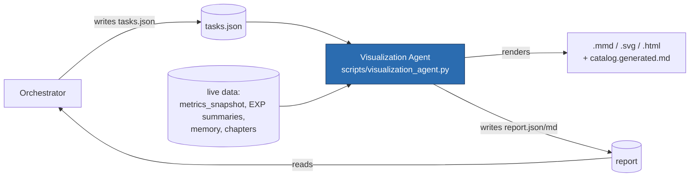

# Visualization Agent & Orchestrator Loop

A dedicated **visualization agent** owns all diagrams, graphs, and charts. It is **advised by the
orchestrator** (which assigns tasks) and **reports back** to it. It refreshes visuals **automatically on each
change** (via the per-prompt refresh hook) and on demand.

## Components
| Piece | Path | Role |
| --- | --- | --- |
| Agent definition | `.claude/agents/visualizer.md` | The dispatchable viz-only subagent (Claude Code). |
| Deterministic engine | `scripts/visualization_agent.py` | Coordinates generators, builds the catalog, writes the report. No API/LLM. |
| Task inbox (orchestrator → agent) | `reports/generated/visualization_agent/tasks.json` | What to render next. |
| Report (agent → orchestrator) | `reports/generated/visualization_agent/report.{json,md}` | What was done / failed / needed. |
| Catalog | `docs/visualizations/catalog.generated.md` | Inventory of every `.mmd` / `.svg` / `.html` in the repo. |
| Task schema template | `docs/visualizations/tasks.template.json` | Copy into the inbox to assign tasks. |

## The loop

## Task types
`evaluation-charts` (data-driven SVGs from `evaluation_summary.json`) · `supervisor-figures` (deck figures) ·
`progress-visualizations` (heavy: Mermaid+HTML) · `results-dashboard` (heavy) · `catalog` (inventory) ·
free-form "create diagram X" (the subagent authors a new `.mmd`/SVG and registers it).

## Automatic on each change — two layers
1. **Per-prompt** (both agents): the fast set (`evaluation-charts`, `supervisor-figures`, `catalog`) runs
   every prompt via `scripts/refresh-tracking.ps1 -Viz` — wired into the Claude `Stop` hook and the Codex
   end-of-prompt step.
2. **24/7 file watcher** (`scripts/watch-visualizations.ps1`): a deterministic background process (no LLM)
   that polls the SOURCE files every ~5 s and, on any change, launches the refresh **in parallel**
   (non-blocking). This is the "works 24/7 / updates on each change" layer.
   - **Singleton + coalesced:** only one watcher runs (PID lock), and refreshes never overlap (no concurrent
     writes to the tracker).
   - **Anti-loop:** only source files are watched; everything the refresh writes (tracker, figures, catalog,
     compiled-memory, dashboard) is ignored, so refreshes never re-trigger the watcher.
   - **Controls:**
     - install + start (no admin; autostarts at every logon via the Startup folder): `.\scripts\watch-visualizations.ps1 -Install`
     - run in foreground: `.\scripts\watch-visualizations.ps1`  · one-shot test: `-Once`
     - stop the running watcher: `.\scripts\watch-visualizations.ps1 -Stop`
     - remove autostart: `.\scripts\watch-visualizations.ps1 -Uninstall`
     - heartbeat/status: `reports/generated/visualization_agent/.watcher.status`

- **Heavy generators** (results dashboard, progress visualizations) run only with
  `python scripts/visualization_agent.py --full` or when listed in `tasks.json`, to keep both layers fast.
- **Honesty:** the 24/7 watcher runs the *deterministic engine*, not an LLM. No Claude/Codex agent runs
  continuously; the watcher just re-renders diagrams from real data when files change. A logon is required
  for the Startup autostart to (re)launch after a reboot.

## Orchestrator usage
1. Write tasks into `reports/generated/visualization_agent/tasks.json` (see template), **or** dispatch the
   `visualizer` subagent with a task in the prompt.
2. The agent renders and writes `report.md`.
3. Read `report.md` to see status and decide the next tasks.

## Boundaries
Visualization only. The agent never edits Agent 4, baseline/`eval_output`, policy/classifier, schemas,
tests, or thesis prose; never fabricates data; uses no API/LLM; writes only under viz directories. Charts
must reflect real source values and the project's honesty gates.
